# Zonovia — Architecture & Product Blueprint

**Prepared by:** Chief Product Architect function (Solution / Enterprise / Security Architecture + Technical Product Management)
**Product owner:** Virasaka
**Status of this document:** v0.1 — for review. No implementation has started. Nothing in this document should be treated as committed until the open questions in §3 are resolved.

---

## Executive Summary

Zonovia is Virasaka's planned flagship product: an enterprise asset-visibility platform that fuses RFID, computer vision, and IoT/BLE sensing — with an AI layer on top — into one live model of every physical asset an organization owns. It is currently a marketing-stage listing on the Virasaka website (`status: coming-soon`, "build has not started") with nine named module pillars and no code, schema, or infrastructure yet.

This blueprint turns that marketing scope into a buildable architecture. The central design bet is: **Zonovia is one modular monolith with a hard internal seam between the Asset domain and the Tracking-technology domain**, deployable unmodified across SaaS, private-cloud, on-prem, and hybrid targets by changing *topology and configuration*, never the codebase. That seam — a `TrackingProvider` abstraction — is what lets today's three tracking pillars (RFID, Vision, Sense) and tomorrow's (GPS, biometric, whatever comes next) plug in without asset-domain code ever knowing which physical technology produced a signal.

Two decisions drive most of the rest of this document:

1. **Start as a modular monolith, not microservices.** Virasaka's own prior products (School Assist AI, Clinic Management System) are both single-backend modular monoliths on FastAPI/PostgreSQL, and both shipped as pilot-ready with a small team. Zonovia should follow the same proven pattern, with exactly one deliberate exception: the **Device Gateway**, which must be independently deployable from day one because it physically runs on the customer's local network next to RFID readers and cameras — not because it needs to scale independently.
2. **Multi-tenancy is a topology choice per deployment tier, not a single global answer.** Shared schema + row-level security for the SaaS shared tier; one database per tenant for Private Cloud, Enterprise, and On-Prem. Same schema, same Alembic migration history, same application code in both cases — only the connection-resolution layer changes. This is what makes the "shared SaaS → dedicated → on-prem" migration path in Model B/C loss-free.

Section 3 lists what must be confirmed with Virasaka stakeholders before Phase 0 starts. Section 36 is a deliberately adversarial risk pass — several requirements in the original brief (all nine tracking technologies at launch, Kafka-class event infrastructure, full ABAC, three separate multi-tenancy strategies) are flagged as over-scoped for an MVP and given a staged alternative.

---

## 1. Product Vision

Zonovia exists to answer four questions an organization can currently only answer with a spreadsheet, a clipboard, or a shrug: **Where is this asset? Who has it? What condition is it in? What is it worth doing about that?**

It is built as a **reusable platform**, not a bespoke application per customer. The same core ships to a five-person clinic and a 40-site hospital network; what differs is which modules are licensed on, which tracking technologies are wired up, and which physical topology (SaaS / private / on-prem / hybrid) the deployment uses.

AI is a platform capability, not a bolt-on: every module emits domain events, and the AI layer (Zonovia AI, Guard, Predict) is a first-class *consumer* of those events, isolated behind a provider-agnostic gateway so the product is never contractually or technically locked to one model vendor.

## 2. Existing Scope From the Virasaka Website

Source reviewed directly from the live site's content model: [`src/content/products.ts`](../../../VirasakaWebsite/src/content/products.ts) and the product detail template at [`src/app/solutions/[slug]/page.tsx`](../../../VirasakaWebsite/src/app/solutions/[slug]/page.tsx) in the `VirasakaWebsite` repo (sibling project, `D:\Projects\VirasakaWebsite`).

**Listing:** category `operations`, status `coming-soon`, statusNote: *"Planned as Virasaka's flagship enterprise asset visibility platform. Build has not started."*
**Tagline:** "One Platform. Every Way to Track."

**The nine published module pillars** (verbatim scope — treated as committed marketing scope, not to be silently removed):

| # | Module | Published capabilities |
|---|--------|------------------------|
| 1 | **Zonovia AI** | Fuses RFID, vision, and sensor data into one live asset model; learns usage/movement patterns over time; plain-language asset queries |
| 2 | **Zonovia Vision** | Tag-free asset ID using existing CCTV/IP cameras; automatic detection of missing/misplaced equipment |
| 3 | **Zonovia RFID** | Passive and active tag support; high-speed bulk and gate scanning; zone-level read accuracy |
| 4 | **Zonovia Sense** | IoT/BLE/sensor tracking; real-time indoor positioning; condition monitoring (temperature, humidity, shock) |
| 5 | **Zonovia Flow** | Full asset lifecycle, procurement to retirement; custody and chain-of-transfer tracking |
| 6 | **Zonovia Insights** | Real-time utilization/idle-time dashboards; scheduled, exportable reports |
| 7 | **Zonovia Guard** | Geofencing and zone-breach alerts; instant notification on unauthorized movement |
| 8 | **Zonovia Predict** | Failure-pattern learning from usage/sensor history; maintenance forecasting and service-window scheduling |
| 9 | **Zonovia Connect** | REST and webhook APIs; pre-built connectors for ERP, HIS/EHR, and school management systems |

**Target users (published):** Hospitals & Clinics, Schools & Campuses, Factories & Warehouses, Retail Operations, Corporate/IT Asset Managers.
**Problem statement (published):** organizations tracking assets manually lose visibility into location, custody, and condition; most competing tools lock a customer into one technology (barcode-only, RFID-only, camera-only) when real environments need several at once.
**How it works (published, 4 steps):** register/tag/enroll with whichever mix of RFID/vision/IoT fits → Zonovia AI fuses every signal into one live model → Guard/Predict watch continuously → Insights turns it into dashboards, Connect syncs it outward.

**Notable gap in the published scope:** QR codes and barcodes — named explicitly in this engagement's brief as required tracking technologies — are **not** one of the nine branded pillars. The public positioning leans on "tag-free" (Vision) and RFID as the differentiators. This is flagged as Open Question OQ-1 in §3; the working assumption in this blueprint is that QR/barcode becomes a **baseline capability of Asset Core itself** (every asset gets a scannable QR identifier for free, no separate module/license), while RFID, Vision, and Sense remain premium, separately licensed tracking modules — because that is the commercially coherent reading of "every way to track" without contradicting the existing nine-pillar marketing.

**Existing Virasaka technical precedent** (reviewed from sibling repos `D:\Projects\SchoolAssist` and `D:\Projects\CMS`, both shipped/pilot-ready products): FastAPI + SQLAlchemy 2.0 (async, `asyncpg`) + Alembic + PostgreSQL 16 + Redis backend, PyJWT + Argon2 auth, React 19 + TypeScript + Vite + TanStack Query + Tailwind 4 web frontend, Flutter mobile, Docker Compose for dev and prod, domain-per-folder modular monolith layout (`app/patients`, `app/billing`, `app/inventory`, …), a dedicated low-privilege Postgres app role separate from the superuser. This is treated as **binding precedent, not a suggestion** — Zonovia should use the same stack unless a specific requirement forces a deviation, so Virasaka's engineers can move between products without a context switch and shared internal libraries (auth, audit log, export, RBAC) can eventually be extracted once, not three times.

## 3. Assumptions & Open Questions

These need a direct answer from Virasaka stakeholders before Phase 0 begins. Nothing downstream is blocked on all of them — most of the architecture holds regardless of the answer — but each changes a concrete deliverable.

| ID | Question | Why it matters | Working assumption used in this blueprint |
|----|----------|-----------------|---------------------------------------------|
| OQ-1 | Is QR/barcode a free baseline capability of Asset Core, or its own licensable module ("Zonovia Tag")? | Changes packaging/pricing and the module dependency graph | Baseline, bundled into Core (see §2 gap note) |
| OQ-2 | Are NFC, GPS, and biometric identification in scope for MVP, or future providers behind the same interface? | Changes Phase 2–6 scope; they exist in the original brief but not in the published 9-pillar site copy | Interface exists now; NFC ships with mobile scanning in Phase 2 (it's just a phone radio); GPS/biometric are Phase 9+ providers, stubbed only |
| OQ-3 | Which two or three industries does Virasaka want the *first* paying pilot in? | Drives which industry pack (Healthcare/Education/Manufacturing/Retail/Corporate) gets built first | Assumed: Healthcare + Education, matching Virasaka's existing CMS/School Assist customer relationships (fastest path to a warm pilot) |
| OQ-4 | Does Virasaka want to sell On-Prem/Private Cloud from day one, or SaaS-only until there's product-market fit? | On-prem licensing (offline validation, packaging) is real scope; deferring it simplifies MVP materially | Assumed: SaaS-first MVP; on-prem capability designed in from the start (topology-agnostic data layer) but the offline-license *feature* itself is built in Phase 9, not Phase 0 |
| OQ-5 | Is there a specific AI provider relationship already in place (Anthropic, OpenAI, Azure OpenAI) or budget ceiling? | Affects AI Gateway default provider and cost modeling for "AI usage" as a licensing dimension | None known — AI Gateway ships provider-agnostic, default provider left as a config decision for launch |
| OQ-6 | Do any target customers (hospital chains, government) have a **hard no-public-cloud** requirement already committed contractually? | If yes, on-prem/private-cloud moves from Phase 9 into MVP scope | Assumed no such commitment exists yet |
| OQ-7 | Should Zonovia share a login/identity system with Virasaka's other products (School Assist AI, CMS) for cross-sell, or be fully independent? | Affects whether Tenant/User is a shared platform service or per-product | Assumed independent for now (each product owns its tenants); revisit if Virasaka wants a unified customer portal |

## 4. Product Capability Map

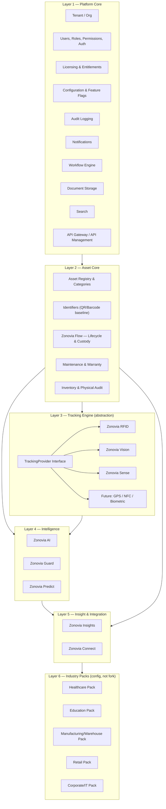

## 5. Functional Architecture

Grouped by the distinction requested in the brief:

- **Core platform capabilities:** tenant/org management, identity & access (RBAC + optional ABAC), licensing/entitlements, configuration & feature flags, audit logging, notifications, workflow/approval engine, document storage, search, reporting engine, API management.
- **Asset management modules:** asset registry, categories/types/attributes, identifiers, lifecycle & custody (Flow), assignment/transfer, maintenance & warranty, inventory & physical audit, disposal.
- **Tracking technologies:** QR/barcode (baseline), RFID, computer vision, IoT/BLE (Sense), with a stubbed provider slot for GPS/biometric/future.
- **Industry-specific capabilities:** Healthcare, Education, Manufacturing/Warehouse, Retail, Corporate/IT packs — each is *configuration + extension fields + a Connect connector*, never a schema fork.
- **AI capabilities:** Zonovia AI (fusion + NL query), Guard (anomaly/loss), Predict (predictive maintenance), AI Gateway (provider abstraction), AI Data Quality assist.
- **Integration capabilities:** Zonovia Connect (REST/webhooks, ERP/HIS/EHR/school-system connectors), Device Gateway (RFID/Vision/Sense hardware ingestion).
- **Administration capabilities:** org/user/role admin, module & license admin, workflow configuration, lifecycle configuration, branding, data retention configuration.

## 6. Domain / Bounded-Context Architecture

Ten bounded contexts, each owning its own tables and publishing events; nothing reaches across a context boundary except through its public service interface or the event bus.

| Bounded Context | Owns | Depends on |
|---|---|---|
| **Identity & Tenancy** | Tenant, User, Role, Permission, Session | — (foundational) |
| **Licensing & Entitlements** | Subscription, License, ModuleEntitlement, UsageCounter | Identity & Tenancy |
| **Asset Core** | Asset, AssetType, AssetCategory, AssetIdentifier, AssetLocation, AssetDocument, Vendor, PurchaseInfo, Warranty | Identity & Tenancy |
| **Asset Lifecycle (Flow)** | LifecycleState, LifecycleTransition, AssetAssignment, AssetMovement, CustodyRecord | Asset Core |
| **Tracking Engine** | Device, DeviceGateway, TrackingEvent, ScanEvent | Asset Core (reads identifiers only) |
| **Maintenance** | MaintenanceTicket, ServiceSchedule, MaintenanceHistory | Asset Core, Asset Lifecycle |
| **Inventory & Audit** | InventoryCycle, InventoryCount, Reconciliation, AuditLog(system) | Asset Core, Tracking Engine |
| **Workflow** | WorkflowDefinition, ApprovalStep, ApprovalInstance | Identity & Tenancy (roles) |
| **AI & Intelligence** | AIInteraction, AnomalyEvent, PredictionRecord, ModelFeedback | Asset Core, Tracking Engine, Maintenance (read-only via events) |
| **Integration** | IntegrationConfig, WebhookSubscription, SyncLog | Asset Core, Identity & Tenancy |

No context in the lower rows (Tracking Engine, Maintenance, Inventory) ever depends on AI & Intelligence — the dependency arrow only points AI-ward, never back. This is the rule that keeps AI removable/optional without touching the rest of the product (Q11 in §35).

## 7. Module Architecture

Each module below follows the fixed shape requested in the brief: ID, dependencies, license requirement, DB ownership.

| Module ID | Name | Depends on | DB tables (owns) | License tier |
|---|---|---|---|---|
| `core` | Platform Core | — | tenant, user, role, permission, audit_log, notification, config, workflow_* | Included in every tier |
| `asset-core` | Asset Registry | core | asset, asset_type, asset_category, asset_identifier, vendor, purchase_info, warranty, asset_document | Zonovia Core |
| `flow` | Zonovia Flow | asset-core | lifecycle_state, lifecycle_transition, assignment, movement, custody | Zonovia Core |
| `track-qr` | QR/Barcode (baseline) | asset-core | *(uses asset_identifier)* | Bundled in Zonovia Core |
| `track-rfid` | Zonovia RFID | asset-core, tracking-engine | rfid_tag, rfid_read_event | Zonovia RFID |
| `track-vision` | Zonovia Vision | asset-core, tracking-engine | vision_enrollment, vision_detection_event | Zonovia Vision |
| `track-sense` | Zonovia Sense | asset-core, tracking-engine | ble_beacon, sensor_reading, position_fix | Zonovia Sense |
| `tracking-engine` | Tracking Engine (abstraction) | asset-core | device, device_gateway, tracking_event | Included wherever any track-* module is licensed |
| `maintenance` | Maintenance & Warranty | asset-core, flow | maintenance_ticket, service_schedule | Zonovia Manage |
| `inventory` | Inventory & Audit | asset-core, tracking-engine | inventory_cycle, inventory_count, reconciliation | Zonovia Manage |
| `ai-core` | Zonovia AI | asset-core, tracking-engine (events) | ai_interaction, asset_state_projection | Zonovia AI (add-on) |
| `guard` | Zonovia Guard | ai-core, tracking-engine | anomaly_event, geofence | Zonovia AI (add-on) |
| `predict` | Zonovia Predict | ai-core, maintenance | prediction_record | Zonovia AI (add-on) |
| `insights` | Zonovia Insights | asset-core, flow, maintenance, tracking-engine | report_definition, dashboard_widget (mostly reads) | Zonovia Core (basic), Zonovia Enterprise (advanced) |
| `connect` | Zonovia Connect | core, asset-core | integration_config, webhook_subscription, sync_log | Zonovia Connect (add-on) |
| `industry-*` | Industry Packs | asset-core, flow, (maintenance for Healthcare) | extension fields only — no new core tables | Bundled per edition (§29) |

### Module dependency graph

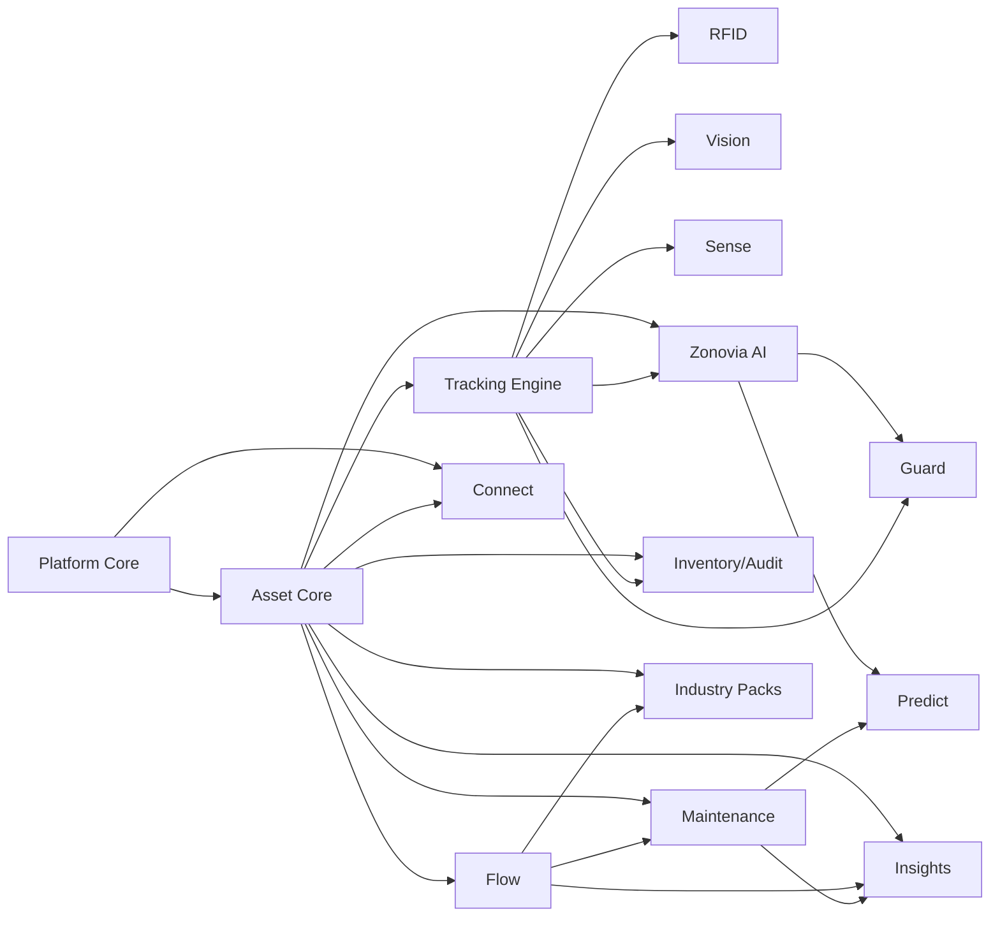

No cycles: everything flows outward from Core → Asset Core → {Tracking, Flow} → {Maintenance, AI} → {Guard, Predict, Insights, Connect}. Industry Packs are always a leaf.

## 8. Recommended Technical Architecture

**Modular monolith**, one deployable backend service, organized as one Python package per bounded context (mirroring CMS's `app/<domain>` convention):

```
backend/app/
  core/            # tenant, identity, RBAC, licensing, audit, workflow, notifications
  asset_core/
  flow/
  tracking_engine/ # provider interface + registry
  providers/
    rfid/
    vision/
    sense/
    qr/
  maintenance/
  inventory/
  ai/
    gateway/       # provider-agnostic AI client
    guard/
    predict/
  insights/
  connect/
```

One exception to "single deployable": the **Device Gateway** ships as its own lightweight service/binary (see §14) because it must run physically close to RFID readers, cameras, and BLE beacons — often on a customer's local network segment with no direct internet route to the core backend. This is a deployment-locality decision, not a scalability one.

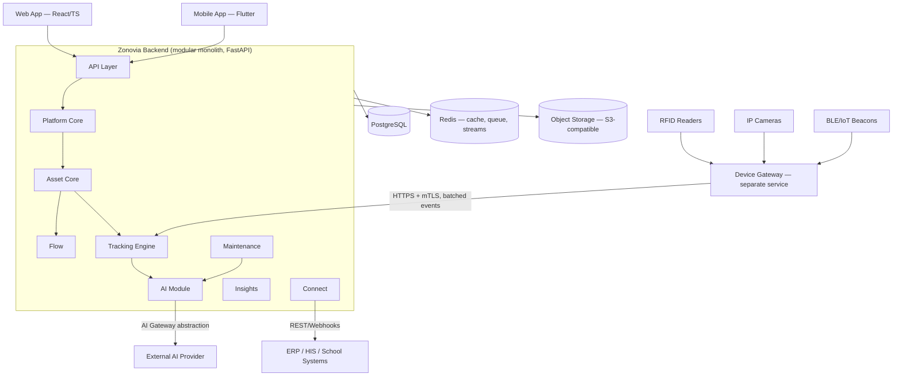

## 9. Multi-Tenant Architecture

Three strategies were evaluated:

| Strategy | Isolation | Ops cost at scale | Migration flexibility |
|---|---|---|---|
| Shared DB / shared schema (+ tenant_id, RLS) | Row-level (policy-enforced) | Lowest — one DB to patch/scale/back up | Easy to spin up a tenant; harder to fully "extract" one later without a migration step |
| Shared DB / schema-per-tenant | Schema-level | Medium — schema sprawl, connection pooling gets awkward past a few hundred tenants | Marginal benefit over RLS for the extra complexity |
| Separate DB per tenant | Full physical isolation | Highest — N databases to patch/back up/monitor | Trivial to relocate a tenant (it's already its own DB) |

**Recommendation:** don't pick one — pick per deployment tier, on the same schema:

- **SaaS shared tier:** shared DB, shared schema, `tenant_id` on every table, PostgreSQL **Row-Level Security** enforcing it at the database layer (not just application-layer filtering — a forgotten `WHERE tenant_id = …` must never be able to leak data). Cheapest to operate for a small ops team; adequate isolation for SMB customers.
- **Private Cloud / Enterprise / On-Prem:** one database per tenant. This is *not* a different codebase or schema — it's the identical Alembic migration history applied to a dedicated database, addressed by a per-tenant connection string. Effectively "run one more copy of the same app+db."
- **Schema-per-tenant is explicitly not built.** It adds real operational complexity (migration fan-out, connection pool sizing) without a customer segment in §3's target list who actually needs it over the two strategies above.

**Tenant → topology migration path** (the requirement in §6 of the brief: shared SaaS → dedicated → on-prem, no data loss): because every row is already `tenant_id`-scoped and the schema is identical everywhere, migration is: (1) logical dump filtered by `tenant_id` from the shared DB, (2) restore into a fresh dedicated database already at the same Alembic head, (3) flip the tenant's entry in the **Tenant Routing Table** (a small core-platform table mapping `tenant_id → connection target`) from "shared pool" to "dedicated DSN", (4) revoke the tenant's RLS-scoped access on the shared DB. No application code changes; the routing table is the only thing a deploy operator touches.

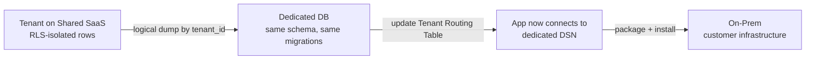

## 10. Deployment Models

### Profile 1 — SaaS

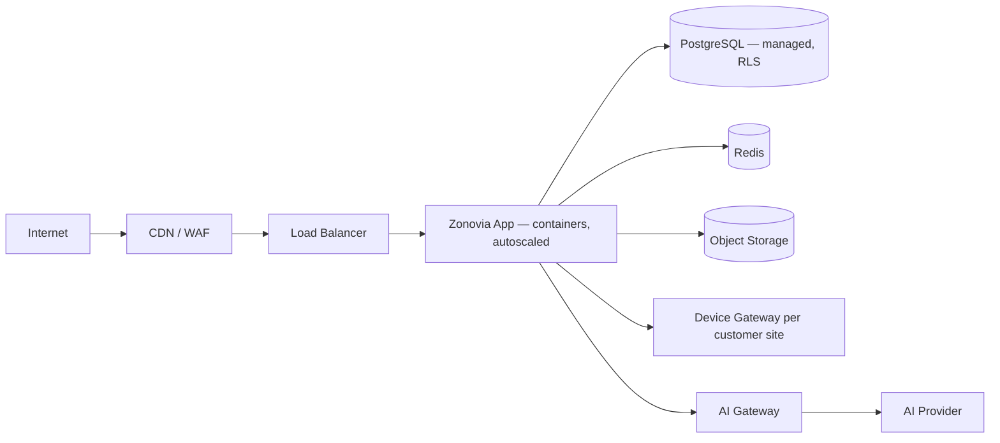

### Profile 2 — Dedicated / Private Cloud

Same container image as SaaS, deployed into a customer-controlled cloud account or a Virasaka-managed dedicated VPC. One database per tenant (per §9). No shared infrastructure with other tenants — the only thing shared is the software.

### Profile 3 — On-Premises

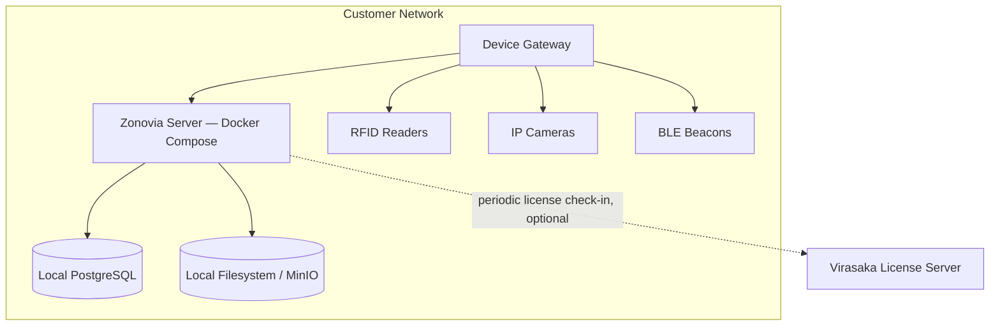

### Profile 4 — Hybrid

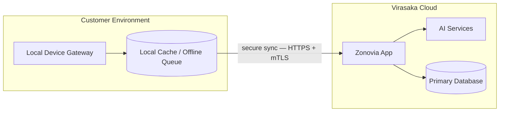

Same principle in every profile above: **one container image, one schema, one Alembic history.** What changes across profiles is infrastructure wiring (managed vs. self-hosted Postgres, CDN present or not, license check-in cadence), never application code.

## 11. Database Architecture

Bounded contexts from §6 map directly to schema ownership. Representative core ER model (Asset Core + Flow + Tracking Engine — the load-bearing center of the schema):

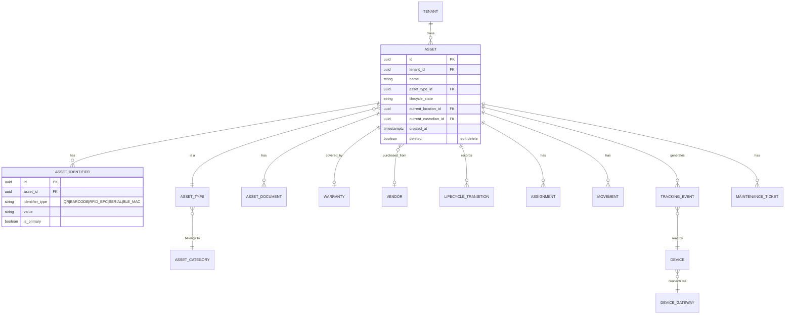

**Key rules:**
- Every tenant-scoped table carries `tenant_id` and is covered by an RLS policy, even on dedicated single-tenant databases — consistency of enforcement matters more than the redundancy cost.
- **An asset has many identifiers, of any type, at any time** — this is the concrete implementation of the "one asset ↔ multiple identification mechanisms" requirement in §4 of the brief. `AssetIdentifier` is a child table, not a column on `Asset`.
- **Soft deletion** (`deleted` boolean + `deleted_at`) on all domain entities that participate in audit/compliance history (Asset, Assignment, Movement, MaintenanceTicket). Hard deletion is never exposed through the product; only a scheduled retention job purges rows past a tenant's configured retention window.
- **Audit strategy:** append-only `audit_log` table (who, what, before/after diff, timestamp, correlation ID) written by a single core service every other module calls through — never written to ad hoc by individual modules, so the audit trail can't be bypassed by a bug in a new module.
- **Indexing:** composite `(tenant_id, …)` leading index on every tenant-scoped table (required for RLS query plans to stay sane); GIN index on `AssetIdentifier.value` for scan-lookup latency; partial index on `lifecycle_state` for the common "show me everything not yet disposed" queries.
- **Partitioning:** `TrackingEvent` and `sensor_reading` are the two tables that will actually grow fast (every RFID/BLE scan is a row). Partition both by month from day one (native Postgres declarative partitioning) so old partitions can be dropped or moved to cold storage per a tenant's retention policy without a table-rewrite.
- **Historical data:** `LifecycleTransition` and `Movement` are themselves the history — there's no separate "audit table" for asset state; the current state is just the latest row, which keeps "what did this look like on date X" a plain query instead of a JSON-diff reconstruction.

## 12. API Architecture

**REST-first**, versioned from `/api/v1/`. GraphQL is **not** recommended for v1 — the primary consumers (a React web app the team controls, a Flutter mobile app the team controls, and Connect's outbound webhooks) don't have the query-shape diversity that justifies GraphQL's added complexity; revisit only if a genuine third-party developer ecosystem materializes.

| API surface | Purpose | AuthN |
|---|---|---|
| Web/Mobile API | Drives the first-party apps | JWT (access + refresh), Argon2-hashed credentials — matches existing Virasaka pattern |
| Device Gateway API | Ingests batched scan/sensor events | mTLS or per-gateway API key; idempotency key required per batch |
| Integration API (Connect) | External systems pull/push asset data | OAuth2 client-credentials or scoped API key |
| Webhooks (Connect) | Push domain events outward | HMAC-signed payloads, customer-configured endpoint |

Standard cross-cutting requirements: URL versioning, pagination (cursor-based for large asset lists), filtering/sorting via query params, a consistent error envelope (`{error: {code, message, correlation_id}}`), a correlation ID on every request threaded through logs, rate limiting per API key/tenant, idempotency keys required on all write endpoints the Device Gateway and Connect use (both are batch/retry-prone by nature).

**Preliminary API catalogue (representative, not exhaustive):**

```
POST   /api/v1/assets
GET    /api/v1/assets?filter=...&cursor=...
GET    /api/v1/assets/{id}
PATCH  /api/v1/assets/{id}
POST   /api/v1/assets/{id}/identifiers
POST   /api/v1/assets/{id}/transition        # lifecycle state change
POST   /api/v1/assets/{id}/assign
POST   /api/v1/assets/{id}/transfer
GET    /api/v1/assets/{id}/history
POST   /api/v1/tracking-events                # Device Gateway ingest, batched
GET    /api/v1/tracking-events?asset_id=...
POST   /api/v1/inventory/cycles
POST   /api/v1/inventory/cycles/{id}/counts
POST   /api/v1/maintenance/tickets
GET    /api/v1/insights/reports/{report_id}
POST   /api/v1/ai/query                        # natural-language asset query
GET    /api/v1/ai/anomalies
GET    /api/v1/ai/predictions
POST   /api/v1/connect/webhooks
GET    /api/v1/admin/modules                   # licensed module list for tenant
GET    /api/v1/admin/audit-log
```

## 13. Tracking Technology Architecture

The `TrackingProvider` interface is the single most important abstraction in the product — it is what lets §4's "an asset should not care which tracking technology is being used" hold true in code, not just in a diagram.

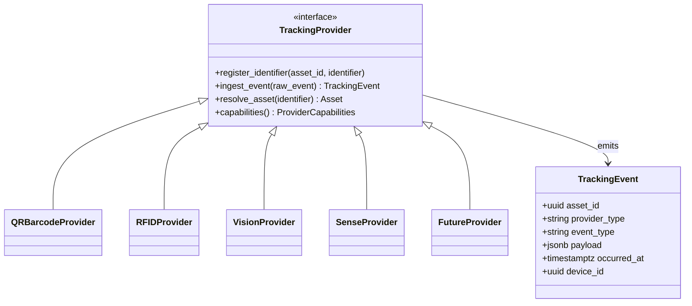

Every provider normalizes whatever it receives (an EPC read, a vision-model bounding-box match, a BLE RSSI ping, a phone camera QR decode) into the same `TrackingEvent` shape before it ever reaches Asset Core. Asset Core subscribes to `TrackingEvent`, never to a provider-specific payload. Adding a tenth tracking technology later means writing one new provider class and registering it — zero changes to Asset Core, Flow, AI, Insights, or Connect.

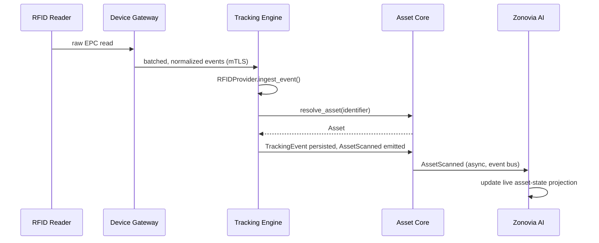

## 14. Device Gateway Architecture

Runs as a small, independently deployable service (on-prem near the hardware, or as a lightweight container the customer runs on their LAN even for SaaS customers) so that RFID/camera/BLE traffic never needs a direct path from hardware to the public internet.

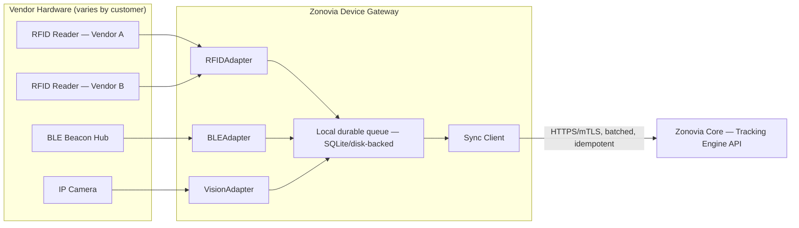

Each `*Adapter` implements a small, vendor-specific interface (`RFIDAdapter`, `BarcodeAdapter`, `BLEAdapter`, `VisionAdapter`, `GPSAdapter`, `BiometricAdapter`, `IoTAdapter` per §11 of the brief) and normalizes into the same `TrackingEvent` shape the core Tracking Engine expects. The local durable queue means a gateway keeps working — reads, detections, sensor pings all still get captured — even if the link to Zonovia Core drops; it drains the backlog on reconnect. This is the same offline-first pattern used for mobile (§15), applied to hardware instead of a phone.

**MVP scope note:** build one real adapter (RFID, via one or two vendor SDKs/LLRP) end-to-end first; stub Vision and Sense adapters behind the same interface so the abstraction is proven before the second and third real integrations are built. Building three hardware integrations simultaneously before any one of them is validated is a named risk in §36.

## 15. Mobile & Offline Architecture

Flutter (matches existing Virasaka precedent), local SQLite (via `drift`) as the on-device store, offline-first by default for every scanning/verification/assignment workflow.

```mermaid
sequenceDiagram
    participant U as Field User
    participant App as Mobile App
    participant Local as Local SQLite (drift)
    participant Sync as Sync Engine
    participant API as Zonovia API

    U->>App: Scan 500 assets (offline, no signal)
    App->>Local: Write scan records, queue op-log entries
    Note over App,Local: Each entry: {op_id (UUID), entity, op_type, payload, client_version}
    App->>Sync: Connectivity restored
    Sync->>API: POST /sync/batch (idempotent, op_ids)
    API->>API: Apply ops; detect conflicts via version compare
    API-->>Sync: {applied, conflicts[]}
    Sync->>Local: Mark applied ops synced; surface conflicts
    App->>U: Conflict review screen (only if any)
```

- **Sync unit:** an append-only local operation log, not a full-record diff — each entry is `{op_id (client-generated UUID, doubles as idempotency key), entity_type, entity_id, op_type, payload, base_version}`.
- **Conflict detection:** optimistic concurrency via a `version` integer on syncable entities. If the server's current `version` doesn't match `base_version` in the op, it's a conflict.
- **Conflict resolution:** last-write-wins for low-stakes fields (e.g., a note); **explicit manual resolution required** for lifecycle-state and custody changes (e.g., two people can't both "assign" the same asset — the second sync surfaces a resolution prompt rather than silently overwriting).
- **Retry/idempotency:** `op_id` is the idempotency key end-to-end, so a batch re-sent after a dropped connection never double-applies.
- **What's offline-capable in MVP:** scanning (QR/barcode via phone camera, RFID via a paired Bluetooth reader if present), asset verification/inventory counting, photo capture, signature capture. Assignment/transfer are offline-capable but always go through the conflict-review path on sync, never silently.

## 16. AI Architecture

AI is isolated behind a gateway interface so the product is never hard-wired to one vendor, and so the module is genuinely optional per the module dependency graph in §7 (nothing in Asset Core, Flow, or Tracking imports an AI SDK directly).

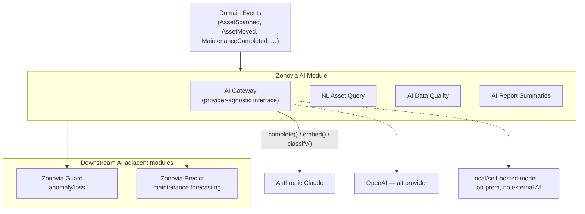

- **AI Gateway contract:** `complete(prompt, context) → text`, `embed(text) → vector`, `classify(input, labels) → label` — three methods, provider-swappable via config. On-prem customers without an AI license (or without external network access) get a no-op/local-only implementation; the rest of the product functions identically with AI features simply disabled, satisfying the licensing/entitlement gate.
- **Anomaly detection (Guard):** rule-based thresholds first (unexpected zone, repeated scans, duplicate identifiers, off-hours movement) with a statistical/ML layer added once there's enough tenant scan history to train against — do not ship a black-box model for anomaly detection before there's data to validate it against.
- **Predictive maintenance (Predict):** starts as a simple recency/frequency model against `MaintenanceHistory` (mean time between failures per asset type), not a bespoke ML pipeline — upgrade to a trained model only once enough tenants have enough maintenance history for one to outperform the heuristic.
- **Data isolation:** AI calls are tenant-scoped and never mix context across tenants; prompts sent to an external provider are logged (`AIInteraction`) for audit, with configurable redaction of sensitive fields per tenant policy.

## 17. Security Architecture

| Control | Approach |
|---|---|
| AuthN | JWT access + refresh tokens, Argon2 password hashing — matches Virasaka's existing SchoolAssist/CMS pattern |
| AuthZ | RBAC as the default; optional ABAC layer (scope by location/department) for Enterprise tier |
| Tenant isolation | PostgreSQL RLS on every tenant-scoped table (§9), enforced at the DB layer, not just application code |
| Transport encryption | TLS everywhere; mTLS between Device Gateway and Core |
| At-rest encryption | Managed disk/DB encryption (cloud-managed for SaaS; LUKS/BitLocker-level for on-prem); no plaintext secrets in config |
| Secrets | Environment-based for on-prem (matches existing `.env` convention); cloud secret manager for SaaS; Vault as an Enterprise option |
| MFA | TOTP-based, Enterprise tier roadmap item (not MVP) |
| SSO | OIDC/SAML — Entra ID, Google Workspace, LDAP/AD — Connect-delivered, Enterprise tier |
| API security | Scoped API keys, OAuth2 client-credentials for Connect, rate limiting per tenant/key |
| Device auth | Per-gateway mTLS certificate or API key, rotate-able independently of user credentials |
| Audit logging | Append-only `audit_log`, every write funneled through one core service (§11) |
| DB privilege | Dedicated low-privilege app DB role, separate from migration/superuser role — matches existing Virasaka Compose convention |
| Key rotation | Documented rotation procedure for JWT signing keys, DB credentials, gateway certs — automatable for SaaS, manual runbook for on-prem |
| File handling | Uploaded documents/photos scanned and content-type validated before storage; object storage with signed, expiring URLs — never a public bucket |

**Compliance posture (explicitly not a compliance claim):** Zonovia will touch data adjacent to HIPAA (hospital asset custody, potentially patient-adjacent equipment context) and FERPA (student device assignment) for the two industries most likely to pilot first (OQ-3). What the architecture provides — encryption, audit trails, RBAC, access logging — are the *engineering controls* a customer's own compliance program would need; achieving an actual HIPAA BAA-ready posture or SOC 2 attestation requires additional process work (vendor risk assessment, breach-notification procedures, a formal ISMS) that is organizational, not architectural, and out of scope for this document.

## 18. Licensing Architecture

Kept deliberately outside the business domain — nothing in Asset Core or Tracking checks a license directly; every module registers its ID, and a single **Entitlement Check** middleware gates API routes by `(tenant_id, module_id)` before a request ever reaches domain logic.

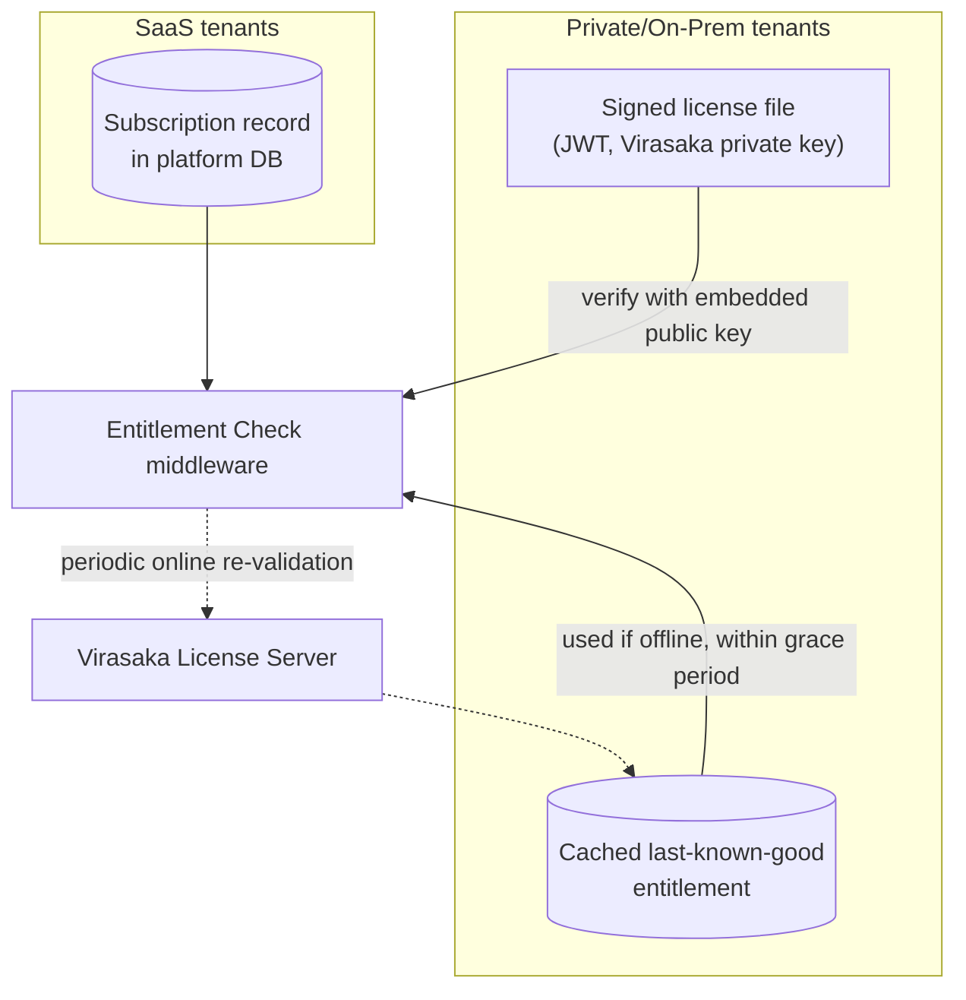

- **SaaS:** entitlement is a live DB lookup against the tenant's `Subscription` — modules, seats, asset-count limits, API/AI usage limits.
- **Private/On-Prem:** a signed license file (JWT-style, signed with Virasaka's private key, verified offline against an embedded public key) encodes tenant ID, licensed modules, asset/seat limits, expiry, and an optional environment-binding hash. A background job attempts periodic online re-validation; on failure, the last-known-good entitlement is used through a **14-day grace period**, after which the deployment degrades to read-only rather than hard-locking (never destroy customer data over a licensing lapse).
- **Licensing dimensions supported:** org, users, assets, locations, modules, storage, tracking devices, API usage, AI usage — each a `UsageCounter` the Entitlement Check can compare against a limit.
- **Tamper resistance:** license file is signed, not encrypted — its contents are not secret, but any modification invalidates the signature. This is proportionate; heavier DRM (hardware dongles, binary obfuscation) is not warranted for this product class and is explicitly not recommended.

## 19. Workflow Architecture

A single configurable engine (not one-off approval logic per module) drives: purchase approval, registration approval, assignment approval, transfer approval, disposal approval, maintenance approval, inventory reconciliation approval.

Supports sequential steps, parallel steps, conditional branches (by asset value, category, or role), role-based approver assignment, SLA-based escalation, and a full approval-history audit trail. Implemented as its own bounded context (`WorkflowDefinition`, `ApprovalStep`, `ApprovalInstance`) that Asset Lifecycle transitions call into rather than embedding approval logic — a lifecycle transition asks the Workflow engine "is this transition allowed to proceed unapproved, or does it need to open an approval instance," and the engine's answer is entirely configuration-driven per tenant.

## 20. Integration Architecture

Zonovia Connect is the one place external-system logic lives — never inside Asset Core. Each customer-specific integration (a particular hospital's HIS, a particular school's SIS) is a `Connector` implementation registered against a generic `IntegrationConfig`, not bespoke code injected into the core domain.

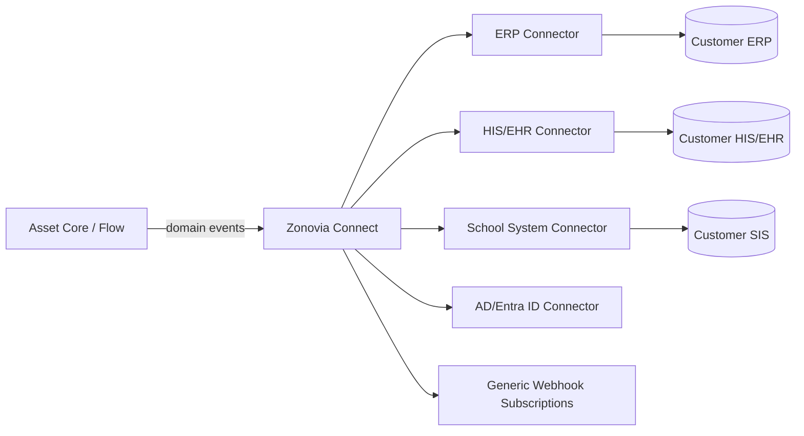

Pre-built connectors ship only for what's actually committed (§3 OQ-3 will determine which two land first); everything else is available as a documented webhook + REST contract a customer's own integrator can consume without Virasaka building a bespoke connector per deal.

## 21. Reporting & Analytics

Zonovia Insights owns a `ReportDefinition` + `DashboardWidget` model driven off read replicas/projections of Asset Core, Flow, Tracking, and Maintenance data — never off live transactional tables for anything heavier than a single-asset lookup, to keep reporting load from contending with write-path performance.

Ships: asset inventory, asset by location/department/employee, lifecycle, movement history, utilization, maintenance, warranty expiry, audit trail, missing/unverified assets, tracking history, inventory reconciliation — as both dashboard widgets (filterable) and scheduled exports (CSV/XLSX/PDF, matching the export libraries — `openpyxl`, `reportlab` — already proven in Virasaka's existing products).

## 22. Backup & Disaster Recovery

| Deployment | Backup approach | RPO target (MVP) | RTO target (MVP) |
|---|---|---|---|
| SaaS | Managed Postgres continuous WAL archiving + daily snapshot; object storage versioning | 15 min | 4 hours |
| Private Cloud | Same as SaaS, within customer's cloud account | 15 min | 4 hours |
| On-Prem | Documented `pg_dump`/WAL-archiving runbook + object storage/local filesystem backup script, customer-operated | 24 hours (customer-dependent) | Customer-dependent, Virasaka provides restore runbook |

Point-in-time recovery via WAL for SaaS/Private; on-prem customers are given a backup verification script and a documented restore drill procedure rather than a managed guarantee Virasaka can't actually enforce on infrastructure it doesn't operate. Backup encryption at rest matches §17's at-rest encryption controls in every profile.

## 23. Observability

Common approach across SaaS and on-prem: structured JSON application logs, the existing `audit_log` for business events, a `/health` endpoint per service (Core, Device Gateway), metrics exposed in Prometheus format (scraped by Virasaka's SaaS monitoring; optional for on-prem customers who want to wire their own), and error tracking (Sentry or equivalent) enabled by default in SaaS, opt-in and self-hosted-compatible for on-prem. Device Gateway additionally reports connectivity/last-seen status and sync-queue depth so a stalled gateway is visible before a customer notices missing scans.

## 24. CI/CD

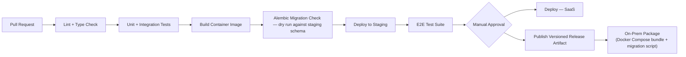

SaaS deploys continuously off `main` after the gate above. On-prem/private customers receive versioned release artifacts (a tagged Docker Compose bundle + an Alembic migration runner) on a slower, customer-scheduled cadence — same build, different delivery mechanism, never a separate branch.

## 25. Upgrade & Migration Strategy

- **Versioning:** semantic versioning on the core platform; each module can carry its own minor version but must declare compatibility with a core version range (checked at startup, refused to boot on mismatch rather than failing unpredictably at runtime).
- **Database migrations:** Alembic, forward-only, additive-first (new nullable columns before backfill before making them required) so a migration never requires simultaneous code+schema deployment — the standard expand/contract pattern.
- **On-prem upgrade path:** ship a new versioned Docker Compose bundle + `alembic upgrade head` run as part of the same upgrade script the customer already uses to update — no manual rebuild. A pre-upgrade backup step is mandatory in the script.
- **Backward compatibility:** API is versioned (`/api/v1/`); a breaking change ships as `/api/v2/` with `v1` maintained through a documented deprecation window, so hundreds of independently-upgraded on-prem installs are never forced onto a hard cutover.
- **License compatibility:** a license file encodes the maximum core version it's valid for major-version bumps that change entitlement semantics, so an old license can't silently unlock new-tier functionality after an upgrade.

## 26. Repository Structure

**Monorepo**, following the layout Virasaka's SchoolAssist product already validated in production use:

```
zonovia/
  backend/            # FastAPI modular monolith — one package per bounded context
  web/                # React + TypeScript + Vite
  mobile/             # Flutter
  device-gateway/     # Independently deployable, adapters per §14
  infrastructure/     # Docker Compose (dev/prod), k8s manifests (later), IaC
  docs/
    architecture/     # this document and future ADRs/diagrams
    api/
  sdks/               # Connect API client libraries, once external integrators exist
  docker-compose.yml
  docker-compose.prod.yml
```

Monorepo over multi-repo because the team is small, the modules are tightly versioned against each other (a module declares a core-version compatibility range — easiest to enforce with atomic commits across the boundary), and Virasaka's own precedent (SchoolAssist) already runs this way successfully. Revisit only if/when Device Gateway genuinely needs an independent release cadence fast enough that monorepo CI becomes a bottleneck — not before.

## 27. Recommended Technology Stack

| Layer | MVP choice | Rationale |
|---|---|---|
| Backend | Python 3.12, FastAPI, SQLAlchemy 2.0 (async), Alembic | Direct match to Virasaka's proven SchoolAssist/CMS stack; async fits device/IoT ingestion |
| Database | PostgreSQL 16 | RLS for multi-tenancy, native partitioning, JSONB for flexible attributes, mature Alembic tooling |
| Cache/Queue | Redis (cache + Redis Streams for the event bus) | Already in the proven stack; sufficient for MVP event volume — see §ADR-006 |
| Search | PostgreSQL full-text (MVP) → OpenSearch only if/when free-text asset search volume or AI-query load genuinely outgrows it | Avoid standing up a second data store before there's a measured need |
| Web | React 19, TypeScript, Vite, TanStack Query, Tailwind 4 | Matches proven stack |
| Mobile | Flutter, `drift` (SQLite) | Matches proven stack; strong offline-first tooling |
| Object storage | S3-compatible (cloud-managed for SaaS, MinIO for on-prem) | Same API in every deployment profile |
| Auth | PyJWT, Argon2 | Matches proven stack |
| Deployment | Docker Compose (MVP, all profiles) → Kubernetes only for SaaS once scale justifies it | Matches proven stack; don't adopt k8s before there's a scaling reason |
| AI | Provider-agnostic gateway; default provider TBD per OQ-5 | Never hard-locked to one vendor |

**When each additional infrastructure component becomes necessary:**

| Component | Trigger to introduce it |
|---|---|
| Kubernetes | SaaS tenant count / traffic requires autoscaling beyond what a fixed Compose/VM fleet handles comfortably — not before |
| Kafka/RabbitMQ | Device telemetry sustained volume or genuine service extraction (Device Gateway or AI as an independently scaled service) outgrows Redis Streams — see ADR-006 |
| OpenSearch/Elasticsearch | Free-text/AI-query search load measurably outgrows Postgres full-text | 
| Schema-per-tenant or additional DB sharding | A specific Enterprise/regulated customer contractually requires isolation beyond dedicated-DB-per-tenant | 
| Dedicated Vault/secrets service | Enterprise customer security review requires it beyond cloud-managed secrets | 

## 28. MVP vs Enterprise Architecture

| Concern | MVP | Enterprise evolution |
|---|---|---|
| Deployment | SaaS only (per OQ-4 assumption) | + Private Cloud, On-Prem, Hybrid |
| Multi-tenancy | Shared DB + RLS only | + Dedicated DB per tenant |
| Tracking | QR/barcode (baseline) + one real RFID adapter | + Vision, + Sense, + GPS/biometric providers |
| Event bus | Postgres outbox + Redis Streams | Kafka/RabbitMQ if/when justified |
| AI | NL query + heuristic anomaly/predictive rules | Trained anomaly/predictive models once data volume supports it |
| Auth | JWT + Argon2, RBAC | + MFA, + SSO/OIDC, + ABAC |
| Licensing | SaaS subscription lookup only | + Offline license files, + grace periods, + hardware binding |
| Search | Postgres full-text | OpenSearch if needed |
| Reporting | Core report set, CSV/XLSX/PDF export | Scheduled reports, advanced dashboards, BI export |

## 29. Product Packaging

Recommended editions — informed by, and consistent with, the nine published module pillars rather than inventing new naming:

| Edition | Includes |
|---|---|
| **Zonovia Core** | Platform Core + Asset Core + Zonovia Flow + baseline QR/barcode identification + basic Insights |
| **Zonovia Track** | Core + one premium tracking module (customer picks RFID, Vision, or Sense) |
| **Zonovia Manage** | Core + Maintenance + Warranty + advanced lifecycle/workflow |
| **Zonovia Intelligence** | Core + Zonovia AI + Guard + Predict (requires at least one Track module for meaningful signal) |
| **Zonovia Enterprise** | Everything — all tracking modules, AI suite, Connect, advanced Insights, SSO/ABAC, private/on-prem eligibility |

This is a starting recommendation for commercial review, not a final packaging decision — final packaging should be validated against OQ-3's pilot industries once known.

## 30. Development Roadmap

Adjusted from the brief's phase list based on the architecture above — Vision and Sense are explicitly deferred behind RFID as the first proven tracking integration (§14, §36 risk R-6), and On-Prem packaging is deferred behind SaaS validation (OQ-4):

| Phase | Scope |
|---|---|
| **0 — Foundation** | Repo, CI/CD, Platform Core (tenant/user/RBAC/audit), DB + RLS, Docker Compose dev environment |
| **1 — Asset Core** | Asset, category, identifier (QR/barcode baseline), location, assignment, movement, lifecycle (configurable), documents |
| **2 — Tracking (baseline)** | QR/barcode scanning end-to-end (mobile + web), tracking events, TrackingProvider interface proven with two real providers (QR + one more) |
| **3 — Inventory & Audit** | Inventory cycles, verification, reconciliation, audit reports |
| **4 — Maintenance** | Maintenance tickets, warranty, service schedules |
| **5 — Mobile & Offline** | Full offline-first mobile scanning/verification/assignment, sync engine, conflict resolution |
| **6 — RFID & Device Gateway** | First real hardware integration: Device Gateway + RFIDAdapter, proven against the abstraction built in Phase 2 |
| **7 — Workflow & Integrations** | Approval engine, notifications, first Connect connector (per OQ-3) |
| **8 — AI** | AI Gateway, NL asset query, data-quality checks, heuristic Guard/Predict |
| **9 — Enterprise** | Vision + Sense providers, SSO, MFA, ABAC, dedicated-DB multi-tenancy, offline licensing, on-prem packaging |

## 31. Testing Strategy

Unit + integration tests per module (matching CMS's existing 217/217-passing precedent); API contract tests against the OpenAPI schema FastAPI generates automatically; RLS-specific multi-tenant isolation tests (a dedicated suite that asserts tenant A can never read tenant B's rows, run against every new table); mobile sync/conflict-resolution tests including simulated dropped-connection scenarios; Device Gateway adapter tests against recorded hardware fixtures (not live hardware in CI); load testing before each major deployment profile goes live; upgrade-path testing (apply Phase N migration to a Phase N-1 seeded database) as a required CI gate before any release artifact is published; DR restore-drill testing on a recurring schedule, not just at launch.

## 32. Risks & Mitigations

| Risk | Impact | Mitigation |
|---|---|---|
| **R-1 — Building all nine pillars simultaneously before any one is validated with a paying pilot** | Large sunk cost before product-market fit is confirmed; matches the brief's own instruction not to over-engineer | Phase roadmap (§30) sequences one tracking technology (QR → RFID) and one industry pack fully through before starting the next |
| **R-2 — Kafka/RabbitMQ-class event infrastructure adopted prematurely** | Operational overhead a small team can't sustain alongside three other Virasaka products | Redis Streams + Postgres outbox for MVP; explicit upgrade trigger in §27 |
| **R-3 — Three multi-tenancy strategies (shared/schema-per-tenant/DB-per-tenant) all built at once** | Migration-fan-out complexity, connection-pool sizing headaches, no customer segment needs all three | Two strategies only (§9); schema-per-tenant explicitly dropped |
| **R-4 — QR/barcode absent from the published 9-pillar marketing scope, but required in the underlying brief** | Packaging/positioning inconsistency if not resolved before sales messaging is finalized | Flagged as OQ-1; architecture already treats it as a bundled Core capability regardless of the marketing-copy answer |
| **R-5 — On-prem offline licensing built before there's a single on-prem customer** | Real engineering investment (signed license files, grace-period logic, environment binding) that may never be exercised if OQ-4 resolves SaaS-only | Deferred to Phase 9; topology-agnostic data layer built now so it's cheap to add later, not built now |
| **R-6 — Vision and Sense (computer vision, IoT/BLE) integrations attempted in parallel with RFID before any one hardware integration is proven** | High risk of the TrackingProvider abstraction being shaped wrong for all three, discovered only after building all three | One real integration (RFID) first, others stubbed behind the same interface; abstraction validated before the second real integration starts |
| **R-7 — AI features tightly coupled into Asset Core for expedience** | Makes AI un-removable, breaks the optional-module/licensing story, creates a vendor lock-in liability | AI Gateway + one-directional dependency rule enforced in §6/§16; no domain-core import of an AI SDK, checked in code review / import-linter |
| **R-8 — Device Gateway treated as "just another module" instead of a separately deployed service** | Breaks on-prem/hybrid deployments where hardware has no direct route to the core backend | Explicitly called out as the one deliberate exception to "single deployable" (§8, §14) |
| **R-9 — RLS policies missing on a newly added table** | Silent tenant-data leak — the most severe class of bug this product can ship | RLS-isolation test suite (§31) required to pass in CI for every new tenant-scoped table, not optional/manual review only |
| **R-10 — Compliance claims (HIPAA/FERPA) overstated to healthcare/education prospects during sales** | Legal and trust exposure if a customer relies on an unsubstantiated claim | §17 explicitly states engineering controls vs. compliance attestation are not the same thing; sales messaging should be reviewed against this distinction |
| **R-11 — Mobile offline conflict resolution silently overwrites a custody/assignment change** | Two field users both "claim" the same asset offline; wrong one wins silently | §15 requires explicit manual conflict resolution for lifecycle/custody-affecting syncs, never last-write-wins |
| **R-12 — Monorepo CI becomes a bottleneck once Device Gateway needs its own release cadence** | Slows down releases for both backend and gateway as the team/product grows | Explicitly flagged as the one condition (§26) under which repo structure should be revisited |

## 33. Architecture Decision Records

### ADR-001 — Modular Monolith vs. Microservices
**Context:** Zonovia is a large, long-term platform, which might suggest microservices.
**Options:** (a) microservices from day one, (b) modular monolith with one exception (Device Gateway), (c) monolith with no exceptions.
**Decision:** (b).
**Reasoning:** Virasaka's own prior products validate the modular-monolith pattern at a small-team scale; microservices add operational cost (service discovery, distributed tracing, N deployment pipelines) with no current scale justification. Device Gateway is the one component whose separation is driven by network locality, not scalability.
**Consequences:** Module boundaries (§6, §7) must be enforced by convention/tooling (import-linter or equivalent), since there's no network boundary forcing discipline.
**Future migration path:** Any bounded context can be extracted into its own service later without a rewrite, because it already owns its own tables and communicates via events/interfaces, not direct cross-module DB access.

### ADR-002 — Database Strategy
**Context:** Need one primary datastore serving both a flexible asset schema and high-volume tracking events.
**Options:** PostgreSQL, MongoDB, a polyglot mix.
**Decision:** PostgreSQL 16, JSONB for flexible/custom asset attributes, native partitioning for event tables.
**Reasoning:** Matches proven Virasaka stack; RLS gives DB-enforced tenant isolation MongoDB doesn't natively offer; JSONB covers the need for per-tenant custom asset fields without a schema-per-tenant EAV nightmare.
**Consequences:** Heavy free-text/AI search may eventually need OpenSearch alongside Postgres (§27), not instead of it.

### ADR-003 — Multi-Tenancy Strategy
**Context:** Must support SaaS-shared, dedicated, and on-prem tenants on one codebase.
**Decision:** Shared DB + RLS for SaaS shared tier; DB-per-tenant for dedicated/on-prem. No schema-per-tenant.
**Reasoning:** See §9.
**Consequences:** A Tenant Routing Table is a required piece of Platform Core from Phase 0, even though dedicated-DB tenants don't exist until Phase 9 — cheaper to build the seam now than retrofit it later.

### ADR-004 — Tracking Technology Abstraction
**Context:** Product must support many current and future tracking technologies without asset-domain coupling.
**Decision:** `TrackingProvider` interface (§13), normalizing every technology into one `TrackingEvent` shape.
**Reasoning:** Directly satisfies the brief's explicit requirement that "an asset should not care which tracking technology is being used."
**Consequences:** Provider-specific richness (e.g., RFID read-power, vision bounding-box confidence) lives in a `payload` JSONB field on `TrackingEvent`, not as first-class columns — keeps the shared event table technology-neutral while not discarding provider-specific detail.

### ADR-005 — Mobile Offline Architecture
**Context:** Field scanning must work with no connectivity, syncing later.
**Decision:** Local SQLite (`drift`) + append-only operation log + optimistic-concurrency conflict detection + mandatory manual resolution for custody/lifecycle conflicts (§15).
**Reasoning:** Silent last-write-wins on custody data is a correctness risk (R-11); an op-log with idempotency keys is the standard, proven pattern for this class of problem.
**Consequences:** UI must budget for a conflict-resolution screen from the first mobile release, not as a later addition.

### ADR-006 — Event Architecture
**Context:** Need async domain events (AssetScanned, AssetMoved, etc.) without over-provisioning messaging infrastructure.
**Decision:** Postgres transactional outbox + Redis Streams for MVP; Kafka/RabbitMQ only past a defined scale trigger (§27).
**Reasoning:** Avoids R-2; Redis is already in the proven stack, so no new operational surface for MVP.
**Consequences:** Revisit before Device Gateway or AI is ever extracted into an independently-scaled service — Redis Streams' delivery guarantees are weaker than Kafka's and that gap must be re-evaluated at that point, not assumed away.

### ADR-007 — Licensing Architecture
**Context:** Must support live SaaS entitlement checks and offline on-prem validation, without coupling licensing to business logic.
**Decision:** Single Entitlement Check middleware (§18); DB lookup for SaaS, signed offline license file for on-prem, both behind the same interface.
**Reasoning:** Keeps licensing swappable/testable and out of domain modules entirely, per the brief's explicit instruction.
**Consequences:** Every new module must register itself with the Entitlement system as part of its own bootstrap — a process, not just a technical mechanism, that needs to be part of the module scaffolding/checklist from Phase 0.

### ADR-008 — AI Architecture
**Context:** AI must be a first-class but removable, vendor-agnostic capability.
**Decision:** AI Gateway abstraction (§16), one-directional dependency (nothing depends on AI; AI depends on domain events).
**Reasoning:** Avoids vendor lock-in and keeps AI a genuinely optional license tier.
**Consequences:** AI features necessarily lag real-time by at least one event-bus hop — acceptable for anomaly/prediction/reporting use cases, would not be acceptable if AI were ever asked to gate a synchronous write path (it should never be).

### ADR-009 — On-Prem Deployment Strategy
**Context:** Must be installable on customer-owned infrastructure without a separate codebase.
**Decision:** Same container image + Docker Compose bundle as every other profile (§10); differences are infrastructure wiring and license-check cadence only.
**Reasoning:** "One product, many topologies" is the core commercial promise (§39 of the brief); a forked on-prem codebase would break it immediately.
**Consequences:** On-prem customers get a slower, versioned release cadence (§24) rather than continuous deployment — an intentional and necessary difference in *process*, not *product*.

### ADR-010 — SaaS Deployment Strategy
**Context:** Need a scalable, multi-tenant hosted offering.
**Decision:** Containerized app behind CDN/WAF/load balancer, managed Postgres with RLS, autoscaled from Phase 0 on Compose/fixed fleet, Kubernetes deferred (§27).
**Reasoning:** Matches MVP-appropriate infrastructure investment; avoids R over-engineering before there's traffic to justify it.
**Consequences:** A defined scale trigger (§27) must actually be monitored, not just documented, or the migration to k8s happens reactively under incident pressure instead of proactively.

### ADR-011 — Configuration vs. Customization
**Context:** Must serve wildly different industries without forking the product per customer.
**Decision:** Asset fields, types, statuses, lifecycle states/transitions, locations, departments, workflows, roles, permissions, notifications, and report definitions are all tenant-level configuration. Industry Packs (§7, §L6) are configuration bundles + extension fields, never a schema fork. Any genuinely customer-specific logic lives outside the core product entirely (a Connect connector or an isolated customization layer), never patched into shared domain code.
**Reasoning:** Directly satisfies §26 of the brief; the single biggest threat to long-term maintainability of a platform like this is per-customer forked code.
**Consequences:** Sales/delivery must be willing to say no to customization requests that can't be expressed through configuration — a commercial discipline question as much as a technical one.

### ADR-012 — Upgrade/Migration Strategy
**Context:** Product will run at potentially hundreds of independently-operated sites (SaaS + on-prem combined).
**Decision:** Expand/contract Alembic migrations, versioned API with deprecation windows, license-file version binding, scripted on-prem upgrade with mandatory pre-upgrade backup (§25).
**Reasoning:** The alternative — assuming every install upgrades in lockstep — does not survive contact with real on-prem customers who upgrade on their own schedule.
**Consequences:** Every schema change must be written as two deployable steps (expand, then contract) rather than one atomic change, which is a real ongoing engineering discipline cost, accepted deliberately in exchange for safe independent upgrades.

## 34. Final Recommended Architecture

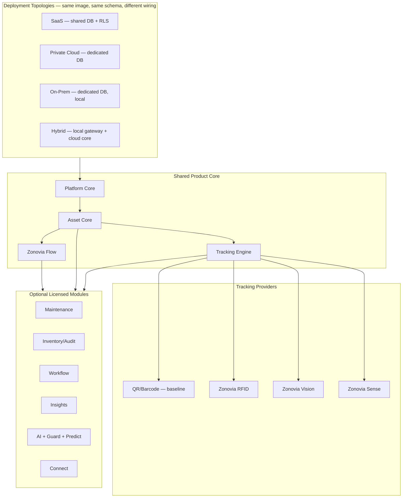

**The commitment this architecture makes:** the same codebase, the same schema, and the same Alembic migration history serve a five-person clinic on shared SaaS and a hospital network's fully isolated on-prem install. Everything that differs between them — tenancy topology, licensed modules, which tracking technologies are wired up, which industry pack's configuration is loaded — is data and configuration, not code.

---

## Next Step

Per the collaboration model set out in the brief: **no implementation starts from this document.** The proposed sequence is Architecture (this document, pending review) → Product Requirements → Domain Model detail → Database schema → Backend → APIs → Web UI → Mobile → Device Gateway → AI → Deployment → Testing → Documentation. The immediate unblock is resolving §3's open questions — OQ-3 (pilot industry) and OQ-4 (SaaS-only vs. on-prem-from-day-one) in particular reshape the Phase 0–2 scope the most.
