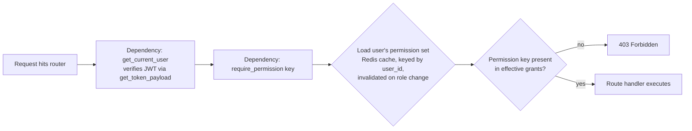

# RBAC Model

## Principle: permission-based, not role-name-based

Code never does `if user.role == "tenant_admin"`. Code does `require_permission("users.create")`. Roles are just named bundles of permissions — a tenant can later create a custom role with a hand-picked permission set without a code change.

## Entities

- **`permissions`** (`app.users.models.Permission`) — a flat, platform-defined catalog of fine-grained permission keys, namespaced by module: `users.view`, `users.create`, `roles.manage`, `audit_logs.view`, `tenants.view_settings`, `entitlements.manage`, etc. New modules ship their own permission keys via a `ModuleDefinition` (`app.core.module_registry`); the catalog is additive, never modified in place. `app.core.bootstrap.register_all_modules()` is the one place every module's `MODULE` constant gets imported and registered — adding a module later means adding one import there, nothing else changes.
- **`roles`** (`app.users.models.Role`) — either **system roles** (`tenant_id IS NULL`: Platform Admin, Tenant Admin, Member, Viewer — seeded once by `app/seed.py::DEFAULT_ROLE_BUNDLES`, shipped with the product) or **tenant-custom roles** (`tenant_id` set — created via `POST /api/v1/roles` by anyone holding `roles.manage`).
- **`role_permissions`** — the bundle. System roles ship with a default bundle; a tenant can create a custom role and pick its own permission set from the catalog.
- **`user_roles`** (`app.users.models.UserRole`) — the grant, **with a scope**: `scope_type`/`scope_id`. Phase 0 only implements/validates `scope_type="tenant"` (enforced both by the Pydantic schema's regex and by `UserService.assign_role`) — there is no location concept yet (`AssetLocation` is Asset Core, Phase 1, per the blueprint's bounded-context table). The column shape already supports narrower future values; this is a deliberately kept seam so Phase 1's location-scoped roles are a `grant_covers()`/`UserService` code change, not a migration.

## Default role bundles (`app.seed.py::DEFAULT_ROLE_BUNDLES`)

Named to be asset-tracking-neutral (not "Super Admin/School Admin/Teacher/Parent" — SchoolAssist's naming) so Phase 1+ modules extend the same buckets without a rename:

| Role | Grants |
|---|---|
| **Platform Admin** | Every registered permission (`tenant_id=None`, `is_system_role=True`), Virasaka staff only. Carries `platform.manage_tenants`, which is what a login checks to set the JWT's `platform_admin: true` claim. |
| **Tenant Admin** | `users.*`, `roles.*`, `audit_logs.view`, `tenants.view_settings`/`tenants.manage_settings`, `entitlements.view` (**not** `entitlements.manage` — toggling a tenant's license is a Virasaka-controlled commercial action, deliberately excluded from this bundle; see `app.entitlements`). |
| **Member** / **Viewer** | `users.view` only in Phase 0 — intentionally near-identical today. Established now so Phase 1's `assets.*` permissions land on them with a real create/edit-vs-read-only split, without a rename later. |

## Authorization check, end to end

`require_permission(key)` (`app.core.deps`) is a dependency factory resolved from `UserService.get_effective_grants`, which is Redis-cached (`app.core.cache`, 5-minute TTL, keyed by `permission_cache_key(user_id)`) so it's not a DB round-trip per request. A Redis outage degrades to "always hit Postgres" rather than failing requests — Postgres is always the source of truth, the cache is a performance optimization on top of it (see `app.core.cache`'s circuit-breaker docstring).

Because Phase 0 has no location-scoped permission use yet, `require_permission`'s inner `checker` takes no extra path/query parameters — it checks "does this user hold this permission key at all." Phase 1's location-scoped modules extend `checker` with a plain (untyped-by-Body) parameter FastAPI will bind from a path/query value by name, the same mechanism SchoolAssist's `school_id`-forwarding fix already establishes as the pattern.

## Assigning a system role requires platform-admin, not just `roles.manage`

`UserService.assign_role` raises `PermissionDeniedError` if the target role has `is_system_role=True` and the actor's token doesn't carry `is_platform_admin`. Without this guard, `roles.manage` alone (held by any Tenant Admin) would be enough to self-escalate to Platform Admin by assigning that system role to themselves. Custom, tenant-scoped roles are unaffected — any Tenant Admin can freely assign roles they created via `create_role`. `RoleRead.grantable` is computed per-request from the caller's own token (not stored on the role), so a UI can disable ungrantable options up front rather than surface a 403 after the fact. See `backend/tests/test_users.py`.

## Module entitlements are a separate gate from permissions

`require_module(module_key)` (`app.core.deps`) and `require_permission(key)` answer two different questions and are meant to compose on the same route: *"is this user allowed to do X"* (permissions) vs. *"is this tenant even licensed for the module X lives in"* (entitlements). `require_module` no-ops for `always_on` modules (Platform Core: `platform`, `users`, `audit`, `entitlements` itself) and otherwise defers to `app.entitlements.EntitlementService.is_enabled`, which falls back to the module's own `ModuleDefinition.default_enabled` when no `TenantModuleEntitlement` row exists yet. See `docs/database.md` and `app.entitlements`'s module docstring for the full licensing story (ADR-007) — every Phase 1+ module composes `require_module()` alongside `require_permission()` from the moment it's written, rather than retrofitting licensing onto an already-built module.
