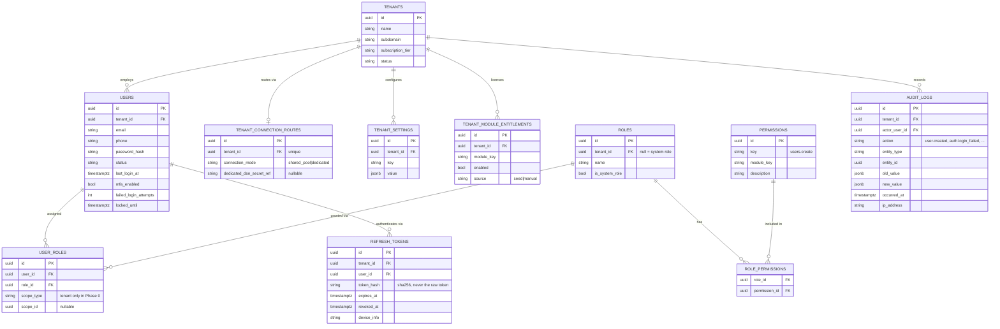

# Database Design (Phase 0 — Platform Core)

PostgreSQL 16, normalized, UUID primary keys. Every tenant-scoped table has `tenant_id`, `created_at`, `updated_at`, `created_by`, `updated_by`, `deleted_at` (soft delete) — see `app.core.base_model`'s mixins. These common columns are omitted from the field lists below to keep them readable.

## Platform Core (everything Phase 0 ships)

## Table-by-table notes

- **`tenants`** — the isolation boundary. Not RLS-protected (it IS the boundary). Ported unchanged from SchoolAssist's `Tenant`; no `School`/`Site` concept — see `docs/multi-tenancy.md`.
- **`tenant_connection_routes`** — new for Zonovia (ADR-003, the Tenant Routing Table). One row per tenant, created alongside the tenant in `TenantService.create_tenant`. Every Phase 0 row is `connection_mode='shared_pool'`. Not RLS-protected — platform-global routing/control-plane data, not tenant-owned domain data.
- **`tenant_settings`** — new for Zonovia (the Configuration deliverable, blueprint §6/§7). A flat, schemaless `key -> jsonb value` store, unique on `(tenant_id, key)`. Phase 0 ships storage + CRUD (`GET`/`PUT /api/v1/tenants/me/settings/{key}`) + audit logging (`tenant_setting.upserted`) and defines zero concrete keys — the first Phase 1+ module that needs a tenant-level setting picks its own key name, no migration required. RLS-protected (standard tenant policy).
- **`tenant_module_entitlements`** — new for Zonovia (`app.entitlements`, ADR-007's minimal Phase 0 form). One row per `(tenant_id, module_key)`; `EntitlementService.is_enabled` falls back to the module's `ModuleDefinition.default_enabled` when no row exists. RLS-protected (standard tenant policy). Explicitly not built in Phase 0: signed license files, license-server check-in, grace periods, hardware binding, usage counters — all Phase 9 per the architecture blueprint's roadmap (§18, §30).
- **`permissions`** — platform-global catalog, not RLS-protected, populated by `app.seed.py::sync_permissions` from every registered `ModuleDefinition`.
- **`roles`** — `tenant_id` is nullable; system roles (`Platform Admin`, `Tenant Admin`, `Member`, `Viewer`) have `tenant_id IS NULL` and are shared across every tenant. RLS-protected with the `tenant_isolation_or_system` variant policy (`tenant_id = current_setting(...) OR tenant_id IS NULL`).
- **`role_permissions`** — pure association table, not independently RLS-protected (never queried without joining through `roles`).
- **`users`** — ported unchanged from SchoolAssist. `password_hash` is Argon2 (`app.core.security`); `failed_login_attempts`/`locked_until` back the per-account lockout in `app.auth.service.AuthService.login`. RLS-protected (standard tenant policy).
- **`user_roles`** — the grant, with `scope_type`/`scope_id`. Phase 0 only implements/validates `scope_type="tenant"` — see `docs/authorization.md`. No `deleted_at`; revoking a role assignment hard-deletes the row (`UserService.revoke_role`). RLS-protected (standard tenant policy).
- **`refresh_tokens`** — stores a SHA-256 hash of the refresh token, never the token itself. Rotated on every use (`AuthService.refresh`: old row's `revoked_at` set, a brand-new row issued) so a stolen-and-reused refresh token is detectable — the second use of an already-rotated token is rejected. RLS-protected (standard tenant policy).
- **`audit_logs`** — append-only, no `deleted_at`/`updated_at` (an editable audit trail isn't one). Written exclusively through `app.core.audit.write_audit_log` — every module's service layer calls this same function rather than inserting rows itself, a deliberate, confirmed two-product Virasaka convention (SchoolAssist, CMS), not an oversight to "improve" with ORM event listeners. RLS-protected (standard tenant policy).

## Indexing & constraints

- Every FK column indexed.
- `(tenant_id, email)` unique on `users`.
- `(tenant_id, key)` unique on `tenant_settings`.
- `(tenant_id, module_key)` unique on `tenant_module_entitlements`.
- `tenant_id` unique on `tenant_connection_routes` (one route per tenant).
- `permissions.key` and `refresh_tokens.token_hash` unique.

## Transaction/commit behavior around business-rule rejections

`app.core.deps.get_db`/`get_public_db` **commit**, not rollback, when the handler raises an `AppError` (a business-rule rejection — wrong password, permission denied, duplicate email, …). This is deliberate: writes made *before* the rejection inside the same request — a failed-login counter increment, an audit log entry recording the rejected attempt — are intentional and must survive the request that "failed." Only a genuinely unexpected exception (anything not an `AppError`) rolls the transaction back. See the docstring on `get_db` in `app.core.deps`.

## Testing tenant isolation

See `docs/multi-tenancy.md`'s dedicated section — two independent test tiers, `tests/test_tenant_isolation.py` (SQLite, application layer) and `tests/test_tenant_isolation_postgres.py` (real Postgres, RLS itself, a required CI gate).
